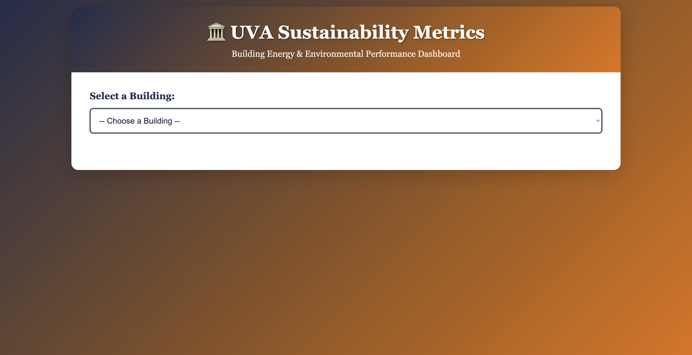
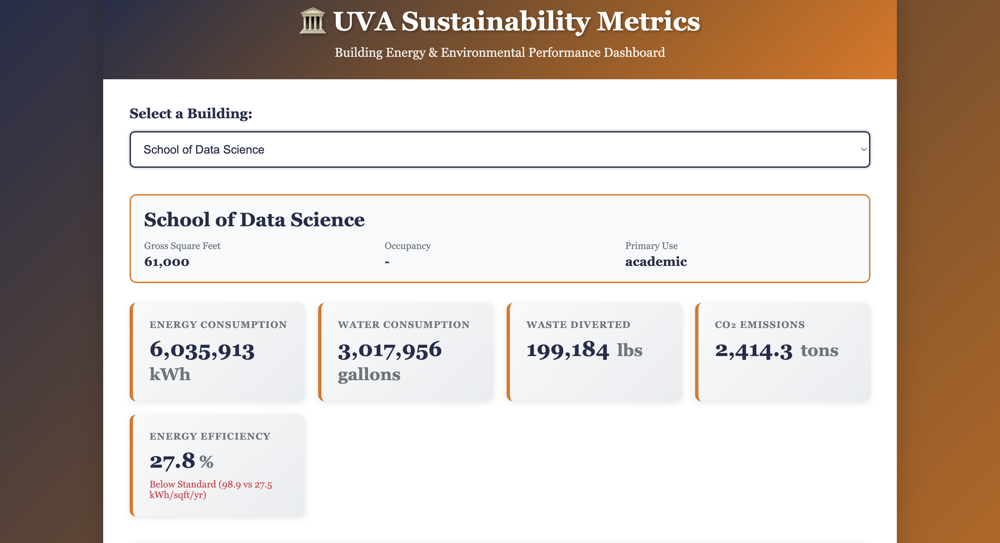
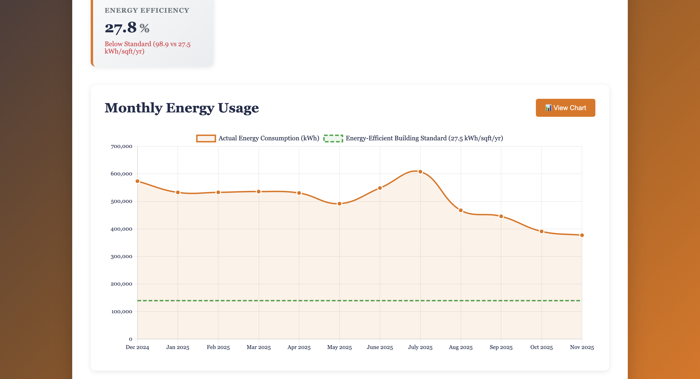

# UVA Sustainability Metrics API

A REST API that serves summarized sustainability metrics for UVA buildings or campus-wide aggregations. This project demonstrates containerization with Docker, Flask API development, and data pipeline concepts from the course modules.

## 1) Executive Summary

**Problem:** University facilities management and sustainability offices need easy access to building-level and campus-wide sustainability metrics (energy consumption, water usage, waste diversion, CO2 emissions) to track progress, identify improvement opportunities, and report to stakeholders.

**Solution:** A containerized REST API that provides programmatic access to sustainability metrics data. The API supports querying by building, year, and provides aggregated campus-wide summaries. The service is packaged in Docker for easy deployment and reproducibility across different environments.

## 2) System Overview

### Course Concept(s)

This project integrates multiple concepts from the course modules:

1. **Flask REST API Development**: Implements a RESTful API using Flask with multiple endpoints for querying sustainability data
2. **Data Pipelines**: Processes CSV data files and provides structured access through API endpoints
3. **Containerization**: Uses Docker for reproducible deployment and environment isolation
4. **Logging & Observability**: Implements structured logging for monitoring and debugging

### Architecture Diagram

```
┌─────────────────────────────────────────────────────────────┐
│                    Client Applications                       │
│         (Web Apps, Dashboards, Scripts, etc.)                │
└──────────────────────┬──────────────────────────────────────┘
                       │ HTTP/REST
                       │
┌──────────────────────▼──────────────────────────────────────┐
│              Flask REST API (app.py)                         │
│  ┌──────────────┐  ┌──────────────┐  ┌──────────────┐      │
│  │ /health      │  │ /api/v1/     │  │ /api/v1/     │      │
│  │              │  │ metrics      │  │ metrics/     │      │
│  │              │  │              │  │ campus-wide  │      │
│  └──────────────┘  └──────────────┘  └──────────────┘      │
│                                                              │
│  ┌────────────────────────────────────────────────────┐    │
│  │         Data Processing Layer                       │    │
│  │  - CSV Loading (pandas)                            │    │
│  │  - Filtering & Aggregation                         │    │
│  │  - JSON Serialization                              │    │
│  └────────────────────────────────────────────────────┘    │
└──────────────────────┬──────────────────────────────────────┘
                       │
                       │ File I/O
                       │
┌──────────────────────▼──────────────────────────────────────┐
│         sustainability_metrics.csv (assets/)                 │
│  - Building names                                            │
│  - Yearly metrics                                            │
│  - Energy, Water, Waste, CO2 data                            │
└──────────────────────────────────────────────────────────────┘

┌─────────────────────────────────────────────────────────────┐
│                    Docker Container                          │
│  - Python 3.11-slim                                          │
│  - Flask + Dependencies                                      │
│  - Health checks                                             │
│  - Port 8080                                                 │
└──────────────────────────────────────────────────────────────┘
```

### Data/Models/Services

**Data Source:** 
- `uva_energy_data_template.csv` - UVA sustainability metrics manually inserted from the website https://energytracker.fm.virginia.edu/#building
- Contains 15 buildings including their energy usage in MMBtu (converted to kWh in the app) from December 2024-November 2025.
- Metrics include: energy consumption (kWh), water consumption (gallons), waste diverted (lbs), CO2 emissions (tons). Water consumption, waste diverted, and CO2 emissions are derived from energy usage data. Included is also gross square footage of the building, occupancy, and the buildings' primary use.
- Building types: academic, multi-purpose/use, dining, medical, fitness

**Data Format:**
- CSV with columns: building, month, year, energy_consumption_MMBtu, gross_square_feet, occupancy, primary_use
- License: MIT (included in repository)

**Services:**
- Flask REST API server
- CORS-enabled for frontend integration
- Health check endpoint for monitoring

## 3) How to Run (Local)

### Prerequisites

- Docker installed and running
- Git (for cloning the repository)

### Quick Start

**Option 1: Using run.sh (recommended)**

```bash
# Make run.sh executable
chmod +x run.sh

# Run the application
./run.sh
```

**Option 2: Manual Docker commands**

```bash
# Build the Docker image
docker build -t uva-sustain-api:latest .

# Run the container
docker run --rm -p 8080:8080 uva-sustain-api:latest
```

**Option 3: Using environment variables**

```bash
# Build
docker build -t uva-sustain-api:latest .

# Run with custom port
docker run --rm -p 8080:8080 \
  -e PORT=8080 \
  -e HOST=0.0.0.0 \
  -e DATA_FILE=assets/sustainability_metrics.csv \
  uva-sustain-api:latest
```

### Health Check

Once the container is running, verify it's healthy:

```bash
curl http://localhost:8080/health
```

Expected response:
```json
{
  "status": "healthy",
  "service": "uva-sustainability-api",
  "data_loaded": true
}
```

### API Endpoints

**List all buildings:**
```bash
curl http://localhost:8080/api/v1/buildings
```

**Get all metrics:**
```bash
curl http://localhost:8080/api/v1/metrics
```

**Get metrics for a specific building:**
```bash
curl http://localhost:8080/api/v1/metrics/Alderman%20Library
```

**Filter metrics by building:**
```bash
curl http://localhost:8080/api/v1/metrics?building=Alderman
```

**Filter metrics by year:**
```bash
curl http://localhost:8080/api/v1/metrics?year=2022
```

**Get campus-wide aggregated metrics:**
```bash
curl http://localhost:8080/api/v1/metrics/campus-wide
```

**Get campus-wide metrics by year:**
```bash
curl http://localhost:8080/api/v1/metrics/campus-wide?year=2022
```

**Get campus-wide metrics aggregated by metric type:**
```bash
curl http://localhost:8080/api/v1/metrics/campus-wide?aggregate_by=metric_type
```

## 4) Design Decisions

### Why Flask?

Flask was chosen as the web framework because:
- **Lightweight**: Minimal overhead, perfect for a simple REST API
- **Flexible**: Easy to extend with additional endpoints and features
- **Course Alignment**: Flask is a core concept covered in the course modules
- **Python Ecosystem**: Seamless integration with pandas for data processing

**Alternatives Considered:**
- **FastAPI**: More modern, but Flask is more established and covered in course
- **Django**: Too heavyweight for a simple API
- **Node.js/Express**: Would require different language ecosystem

### Why Docker?

Docker provides:
- **Reproducibility**: Same environment across development, testing, and production
- **Isolation**: No conflicts with system Python packages
- **Portability**: Runs on any system with Docker installed
- **Course Requirement**: Containerization is a key learning objective

**Alternatives Considered:**
- **Apptainer**: Good for HPC environments, but Docker is more widely used
- **Virtual environments**: Don't provide the same level of isolation and portability

### Tradeoffs

**Performance:**
- CSV loading happens at startup (acceptable for small datasets)
- In-memory data processing is fast but doesn't scale to very large datasets
- For production with large datasets, consider database integration

**Cost:**
- Minimal resource requirements (suitable for small deployments)
- No external service dependencies (no API costs)

**Complexity:**
- Simple architecture makes it easy to understand and maintain
- No database setup required (CSV is sufficient for demo)
- Tradeoff: Limited scalability without database

**Maintainability:**
- Clear separation of concerns (API endpoints, data loading, processing)
- Structured logging aids debugging
- Well-documented endpoints

### Security/Privacy

**Secrets Management:**
- No secrets hardcoded in the application
- Environment variables used for configuration
- `.env.example` provided as template (no actual secrets in repo)

**Input Validation:**
- Basic validation on query parameters (year, building name)
- Error handling for malformed requests
- SQL injection not applicable (no database), but input sanitization considered

**PII Handling:**
- Current dataset contains no personally identifiable information
- Only building names and aggregate metrics
- If expanded to include individual-level data, would need additional privacy measures

**Network Security:**
- CORS enabled for development (should be restricted in production)
- No authentication/authorization implemented (acceptable for demo)
- Production deployment should add API keys or OAuth

### Ops

**Logging:**
- Structured logging with timestamps and log levels
- Logs to stdout (Docker best practice)
- Can be collected by container orchestration platforms

**Metrics:**
- Health check endpoint for monitoring
- Response times logged for performance tracking
- Could add Prometheus metrics in future

**Scaling Considerations:**
- Stateless design allows horizontal scaling
- Current implementation loads data at startup (shared across instances)
- For multi-instance deployment, would need shared data store (database)

**Known Limitations:**
- Data loaded at startup only (no hot-reload of CSV changes)
- No caching (every request processes data)
- No rate limiting (could be overwhelmed by high traffic)
- Single CSV file (not suitable for very large datasets)

## 5) Results & Evaluation

### Screenshots/Sample Outputs

#### Dashboard Screenshots

**1. Building Selection Dashboard**

*The UVA Sustainability Metrics dashboard with building selector dropdown*

**2. Building Details Dashboard**

*Detailed view showing sustainability metrics for School of Data Science including energy consumption, water consumption, waste diverted, CO2 emissions, and energy efficiency*

**3. Energy Efficiency Dashboard**

*Energy efficiency metrics showing monthly energy usage comparison between actual consumption and the energy-efficient building standard*

#### API Response Examples

**Health Check:**
```json
{
  "status": "healthy",
  "service": "uva-sustainability-api",
  "data_loaded": true
}
```

**List Buildings:**
```json
{
  "count": 15,
  "buildings": [
    "Alderman Library",
    "Rotunda",
    "Clemons Library",
    "Newcomb Hall",
    "Rice Hall",
    "School of Data Science",
    "Student Health Center",
    "Aquatic & Fitness Center",
    "Clark Hall",
    "John Paul Jones Arena",
    "New Cabell Hall",
    "Old Cabell Hall",
    "Scott Stadium",
    "University Hospital",
    "O-Hill",
  ]
}
```

**Building Metrics:**
```json
{
  "building": "Alderman Library",
  "count": 3,
  "data": [
    {
      "building": "Alderman Library",
      "year": 2020,
      "energy_consumption_kwh": 1250000,
      "water_consumption_gallons": 850000,
      "waste_diverted_lbs": 45000,
      "co2_emissions_tons": 285.5,
      "metric_type": "academic"
    },
    ...
  ]
}
```

**Campus-Wide Metrics:**
```json
{
  "aggregation": "year",
  "data": [
    {
      "year": 2020,
      "energy_consumption_kwh": 12430000,
      "water_consumption_gallons": 6960000,
      "waste_diverted_lbs": 401000,
      "co2_emissions_tons": 2835.8,
      "total_buildings": 10
    },
    ...
  ]
}
```

### Performance Notes

- **Startup Time**: ~2-3 seconds (Docker image pull + container start)
- **API Response Time**: <50ms for most endpoints (in-memory processing)
- **Memory Footprint**: ~150MB (Python + Flask + pandas)
- **Container Size**: ~200MB (python:3.11-slim base image)

### Validation/Tests

**Smoke Tests:**
- Health check endpoint returns 200
- All API endpoints return valid JSON
- Building filtering works correctly
- Year filtering works correctly
- Campus-wide aggregation calculates correctly
- Error handling for invalid inputs

**Test Execution:**
```bash
# Install test dependencies
pip install -r tests/requirements.txt

# Run tests
pytest tests/test_api.py -v
```

**Test Coverage:**
- Health check endpoint
- List buildings endpoint
- Get all metrics endpoint
- Filter by building
- Filter by year
- Get specific building metrics
- Campus-wide aggregation
- Error handling (invalid building, invalid parameters)

## 6) What's Next

### Planned Improvements

1. **Database Integration**
   - Replace CSV with PostgreSQL or MongoDB
   - Support for larger datasets
   - Real-time data updates

2. **Authentication & Authorization**
   - API key authentication
   - Role-based access control
   - Rate limiting

3. **Enhanced Features**
   - Time-series analysis endpoints
   - Trend calculations (year-over-year changes)
   - Comparative analysis (building vs. building)
   - Export to CSV/JSON

4. **Observability**
   - Prometheus metrics integration
   - Request tracing
   - Performance monitoring dashboard

5. **API Documentation**
   - OpenAPI/Swagger specification
   - Interactive API documentation
   - Code examples for common use cases

6. **Deployment**
   - Kubernetes deployment manifests
   - CI/CD pipeline (GitHub Actions)
   - Cloud deployment (AWS/GCP/Azure)

7. **Data Pipeline**
   - Automated data ingestion from source systems
   - Data validation and quality checks
   - Scheduled data updates

## 7) Links

**GitHub Repo:** [https://github.com/MadelineHeathh/uva-sustain-api]

---

## Project Structure

```
uva-sustain-api/
├── src/
│   └── app.py                 # Flask API application
├── assets/
│   └── sustainability_metrics.csv  # Sample data
├── tests/
│   ├── test_api.py           # Smoke tests
│   └── requirements.txt       # Test dependencies
├── Dockerfile                 # Docker container definition
├── requirements.txt           # Python dependencies
├── run.sh                     # One-command launcher
├── LICENSE                    # MIT License
└── README.md                  # This file
```

## License

This project is licensed under the MIT License - see the [LICENSE](LICENSE) file for details.

## Credits

- **Dataset**: UVA Sustainability Metrics Data: https://energytracker.fm.virginia.edu/#building
- **Framework**: Flask (https://flask.palletsprojects.com/)
- **Data Processing**: Pandas (https://pandas.pydata.org/)
- **Containerization**: Docker (https://www.docker.com/)

## Contributing

This is a course project. For questions or issues, please open an issue in the GitHub repository.

